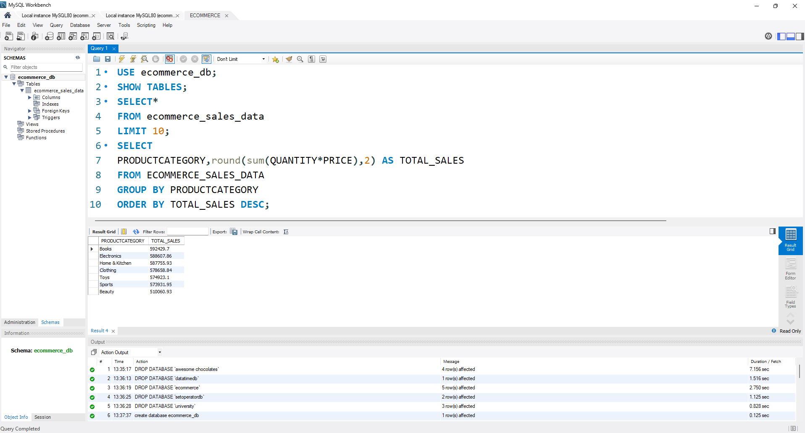

# SQL E-commerce Sales Analysis

## Objective
Analyze e-commerce sales data using SQL to answer key business questions.

## Tools Used
- SQL (MySQL / PostgreSQL)

## Business Questions

- Total revenue by month
- Top-performing products
- Top customers
- Regional sales performance
 
## Results

### Revenue by Product Category

## Insights
- Books and Electronics generate the highest revenue, indicating strong customer demand in these categories.
- Beauty and Sports contribute comparatively lower revenue and may require targeted promotions or pricing strategies.
- Revenue is concentrated in a few top categories, suggesting opportunities to diversify product offerings.
