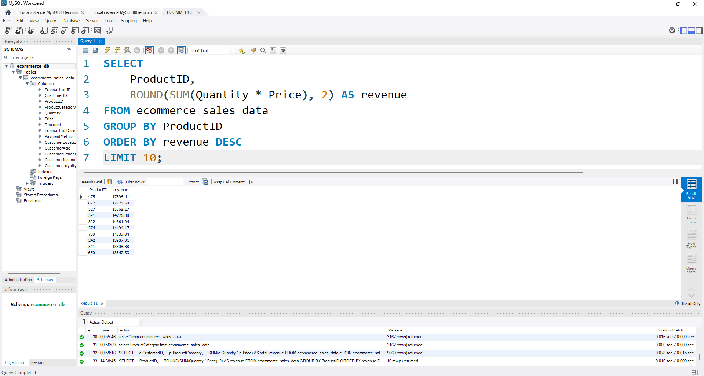

# SQL E-commerce Sales Analysis

## Objective
Analyze e-commerce sales data using SQL to answer key business questions.

## Tools Used
- SQL (MySQL / PostgreSQL)

## Business Questions

- Which product categories generate the highest total revenue?
- Which individual products contribute the most to overall sales?
- Who are the top customers based on total revenue?
- How does each customer’s revenue compare to the average customer revenue?
- What is the total sales revenue by country?”
 
## Results

### Revenue by Product Category

### Top 10 Products by Revenue

### Customer Revenue Analysis (CTE + Window Function)

## Insights
- Books and Electronics generate the highest revenue, indicating strong customer demand in these categories.
- Beauty and Sports contribute comparatively lower revenue and may require targeted promotions or pricing strategies.
- Revenue is concentrated in a few top categories, suggesting opportunities to diversify product offerings.
